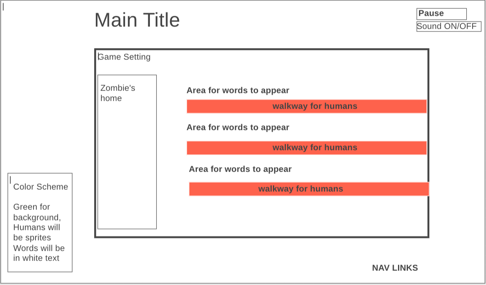

# ahhh urRrRR Orrr!!(keep humans away) 

## BackGround

ahhh urRrRR Orrr!! is a classic twist on a typing game. Help the zombies defend from humans by using their word powered weapons??? Inspired by the game, Typing of the Dead, this game aims to test a player's typing skills. 

This game will play out on 4 rectangular grids. Each rectangle will serve as a path for a evil human to walk towards the zombies' home. 

The game will play out with these rules:

    1. Each rectangle will have a set amount of humans walking from right to left. 
    2. To prevent a human invading, a player must type a word that is associated with each rectangle lane. 
    3. A player will lose if a human reaches the other side. 
    4. As levels progress, words will contain more letters and huamns will run faster. 

This variation on a typing game is meant to improve a player's typing speed. 

#Functionality & MVPs

With this human survival game, players will be able to
    .Choose from survivial mode or level progression
    .Choose a starting difficulty for survival and level
    .Pause button to unpause/pause the game 
    .Background music as well as zombie soundeffects

In addition, this project will include: 
    . A production README
    . An About modal describing the background and rules of the game 

#WireFrames

.NAV Links will include githubrepo, Linkedin

. GameControls will all be controlled with typing(example; to start game, player will need to type 'start')

. Top right hand will have button for pause and sound toggle

. Center of page will contain the game where players will be inputting letters to play 

#Technologies, Libraries, APIs

This project will be implemented using the following technologies:
    .Canvas API to render game board 
    .Webpack and Babel to bundle and transple the source JavaScript Code 
    .npm to manage project dependencies 
    .https://api.quotable.io to obtain quotes
    .https://random-word-api.vercel.app/ to obtain random words 
  
    .A website that provides free sprites (TBD)

Implementation Timeline 

NB: 

    .Friday Afternoon and Weekend: Setup Project (webpack, canvas), get comfortable with canvas, and eventlisteners. Create board, moving object (human, and projectile classes), game classes. Have a grid rendered to the canvas where humans can spawn 

    .Monday: dedicate day towards implementing underlying logic of ahhh urRrRR Orrr!!(keep humans away). Ensure that words are randomly generated and can be typed to cleared 

    .Tuesday: Combine gamelogic and canvas. Each typed out word or phrase will damage a human. Words and humans will continue to spawn until player loses 

    .Wednesday: Implement game sound and soundtrack if possible. Continue to clean up any bugs related to the game.

    .Thursday: Deploy to GitHub pages

    

#Bonus features

    .Add bosses (bosses will require multiple words, or phrases)
    .Track words per minutes for a player
    .Offer optional themes for a player

